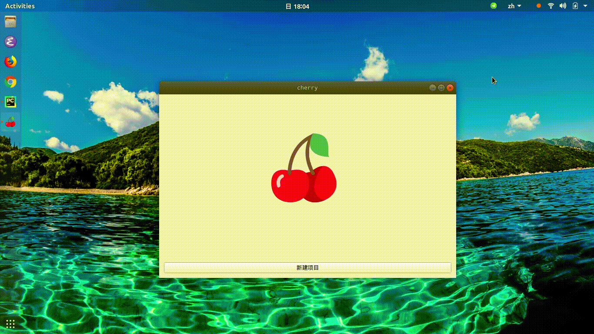
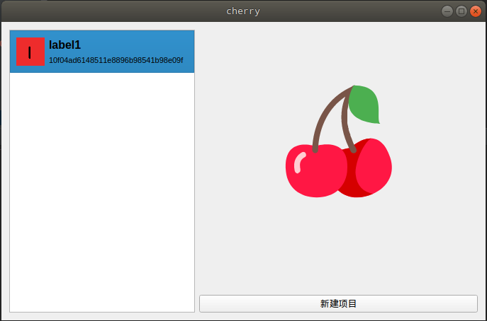
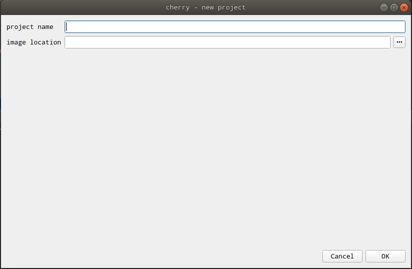
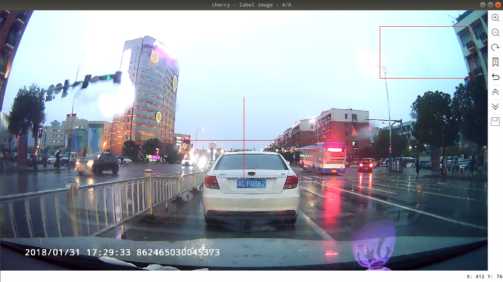

## 软件简介
cherry是一款用于图片标记的软件，可用于深度学习、机器学习相关项目中对数据标记任务。标记任务、标记数据均使用数据库进行存储与管理，可满足独立标记任务的需求。针对算法训练图片标记数据的多样性，可以数据库数据为起点对数据进行处理，满足相应数据需求。

## 开发环境
* ubuntu 17.10正式版  
* PyCharm社区版  
* Python 3.6.3  

## 使用示例
### 新建任务

### 标记图片

## 快捷键
| 快捷键 | 作用 |
| -------|:----:|
| Ctrl+E | 放大 |
| Ctrl+N | 缩小 |
| Ctrl+R | 恢复 |
| Ctrl+Q | label|
| Ctrl+Z | 撤销 |
| Ctrl+S | 保存 |

## 软件界面
### 欢迎界面

### 新建项目界面

### 标记界面

